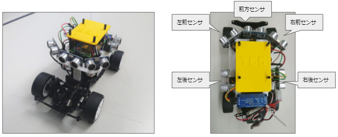

# 自動運転ミニカーバトル2024 制限部門シミュレータ v0.1

## Overview

- トヨタ技術会で開催する自動運転ミニカーバトル、制限部門向けのシミュレータです。コース、マシンの挙動を簡易に再現しています。
- Pythonプログラムを書き換えることで、シミュレータ上でマシンを走らせることができます。
- シミュレータ上で試行錯誤をして、参加チームが行った検討をぜひ体験してみてください！

> [!WARNING]
>
> - 本シミュレータはGoogle Colaboratoryで実行されます。実行するにはGoogleアカウントにログインしている必要があります。
> - 実際の挙動を忠実に再現できているわけではありません。

## Introducing machine

- 1/14ラジコンを改造。
- Raspberry Piで電子制御。
- 超音波センサーを5つ搭載し、コース上の壁との距離を検知。

## How to use

### Step 1: Run in default modes

まずはデフォルトの状態でシミュレーションを実行する。

1. シミュレーションの実行
   - 準備
   - ループ前プログラム
   - ループ内プログラム
   - シミュレーション設定
   - シミュレーション開始
   - シミュレーション結果描画(2分程度)
2. シミュレーション結果を再生
3. 走行中のプログラムの状態を確認

### Step 2: Change your program

### Step 3: Re-run to confirm operation
